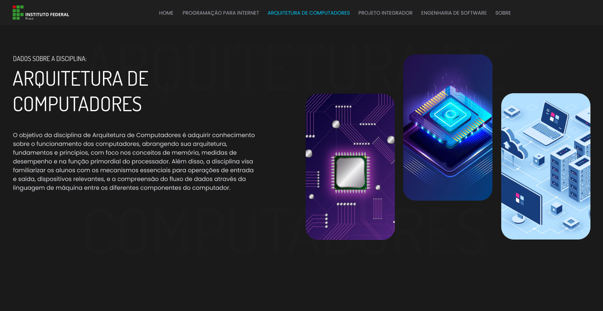

# Sobre o projeto

Esse projeto é uma atividade avaliativa da disciplina de programação paar internet I do curso de Analise e desenvolvimento de sistemas.

 

## A proposta da atividade era a seguinte:

O objetivo deste projeto é criar um site completo para exibir os dados pessoais de um aluno, juntamente com seu desempenho em trabalhos de determinadas disciplinas. O site terá 4 sub-sites, representando cada uma das seguintes disciplinas: Programação para Internet, Arquitetura de Computadores, Projeto Integrador e Engenharia de Software.

## Estrutura do Site
### A estrutura do site deve ser organizada da seguinte forma:

* Na raiz do site principal, crie os arquivos index.html e sobre.html;
* Para cada sub-site (disciplina), crie uma pasta com o nome da disciplina. Cada sub-site deve conter um arquivo de index.html.
* Conteúdo Principal
    * O arquivo sobre.html conterá um texto descritivo sobre a página, informando sua função de apresentar os dados dos alunos em relação às 4 disciplinas.
    * O arquivo index.html principal deve conter um título descritivo, uma seção contendo links para cada sub-site, e informações básicas sobre o aluno, como uma foto de perfil (ou avatar neutro), nome, curso, instituição e período que está cursando.
    * Conteúdo dos Sub-sites
        * Um título descritivo.
        * Um ou mais parágrafos contendo um texto descritivo sobre a disciplina, como ementa, assuntos abordados, etc.
        * Um iframe do Youtube contendo um vídeo relacionado à disciplina.
        * Uma tabela descrevendo um trabalho em grupo para a referida disciplina, contendo uma lista com o nome de pelo menos 5 alunos matriculados, seus e-mails e notas fictícias.

## Feito com

* HTML5
* CSS3
* Javascript
